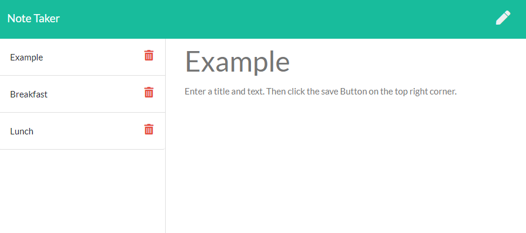

# Note-taker

## Description
This is an application that can be used to write and save notes.
It uses an Express.js back end and will save and retrieve note data from a JSON file.

## Table of Contents 

* [Installation](#installation)
* [Output](#Output)
* [Questions](#questions)

## Installation
* Run `npm install` to install the required npm packages-express.  
* To use locally, run `npm run start:dev`. 
* Open the app in your browser using `http:localhost:3001`.  
You can also view the deployed website here: 
https://express-note-taker-by-cynthia.herokuapp.com/

 
View the video walk through here: 

https://youtu.be/m6hoU5parnM/

 
 

## Output

## Questions
View my Github Profile at [CynthiaMohan](http://github.com/CynthiaMohan)
 
Reach me with more questions <cynthiamohan1@gmail.com>
